# Some checkpoint results (without fine-tuning/small-scale)
Here are the blowup trees given by a couple trained agents. But the hyperparameters are not fine-tuned and they are very small scale.

Recall that each integral point corresponds to a monomial, and we are considering the hypersurface defined by the sum of the monomial. For example, an initial state of $[[2,0,0], [0,2,0], [0,0,3]]$ corresponds to

$$x^2+y^2+z^3=0$$.

Feel free to check out the [best model](#0.14). The rules of games are changed slightly (reposition the points after making the coordinate changes, so that we disregard the exceptional divisors). There are a lot of game states (existence of one of $[1, 0, 0], [0, 1, 0], [0, 0, 1]$ in the game state already implies smoothness). Thus, **the trees contain a lot of redundancy**.

## model with 0.1 score against choose-first/choose-last
### A1
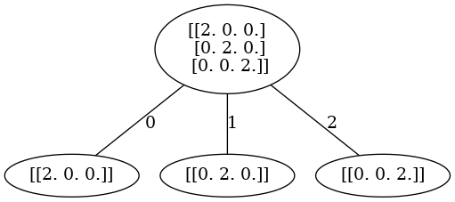

A1 is the most classical nodal singularity. As long as it is not blowing up a line, it would be resolved with one single blowup.

### A2
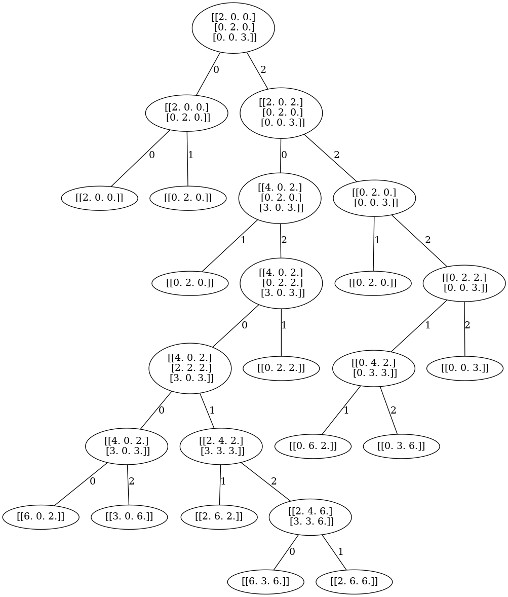

A2 should have been resolved with one single blowup as well. But apparently the host made the wrong choice in the first step. However, a further trained checkpoint was able to find the simplest result.

### A3
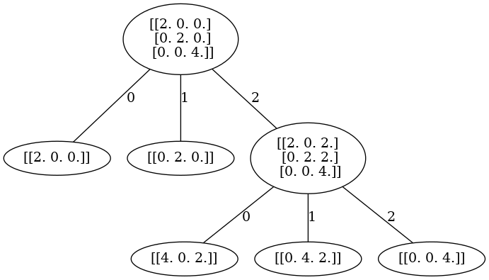

A3 could be resolved in two blowups at 0-dimensional strata. Indeed the host found the best solution!

### D4
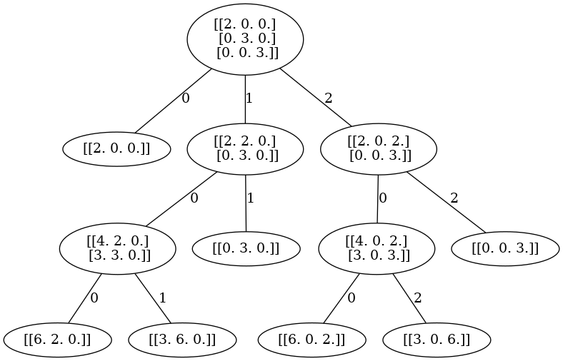

A resolution of D4 (this is perhaps slightly more complex than the D4 Dynkin diagram, but is it minimal under the constraint of blowing up toric strata?).

### D5
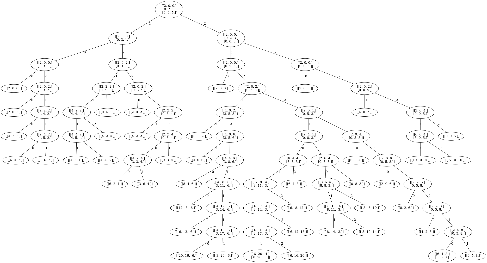

It did not terminate for D5 under prescribed maximal depth.

### E6
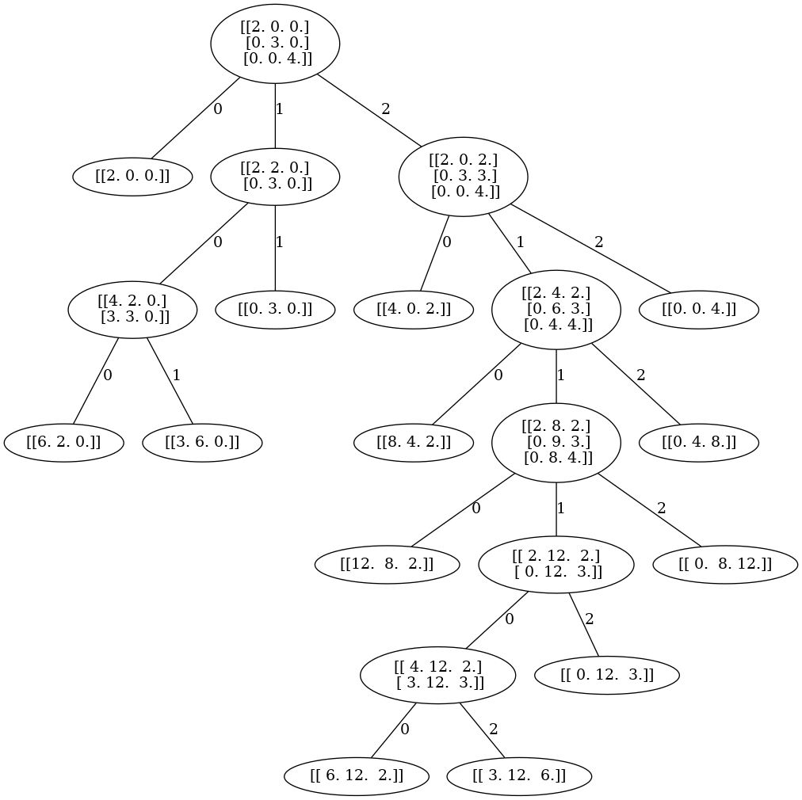

A nice resolution for E6.

### E7 and E8
[E7](0.1-model/E7.png) and [E8](0.1-model/E8.png) did not end up terminating.

## [model with 0.14 score against choose-first/choose-last][0.14]
Now in this case, we turned on `reposition`. After shifting, each coordinates will be translated so that at least one point touches the coordinate planes (the coordinate equals to zero).

In resolution, it is equivalent to the fact that we throw away the exceptional divisor, and only look at the strict transform (and make sure it is smoothed).

I emphasize that **the trees contain a lot of redundancy**, as I did not bake the following rule into the game: 
- containing a point $(x_1, x_2, x_3)$ with $x_1+x_2+x_3=1$ already implies smoothness.

### A2
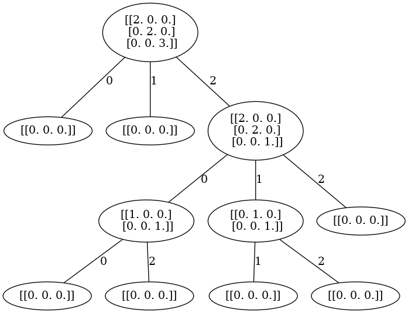

A2. Optimal. In fact ((1, 0, 0), (0, 0, 1)) was already smooth, but under our game it was not. Of course one could bake this into the rule of the game, but resolving the game from states like this seems to be easy enough. 

### A3
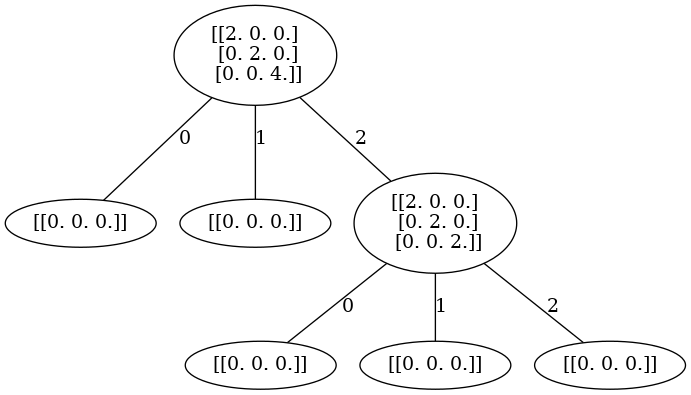

A3. Optimal

### A4
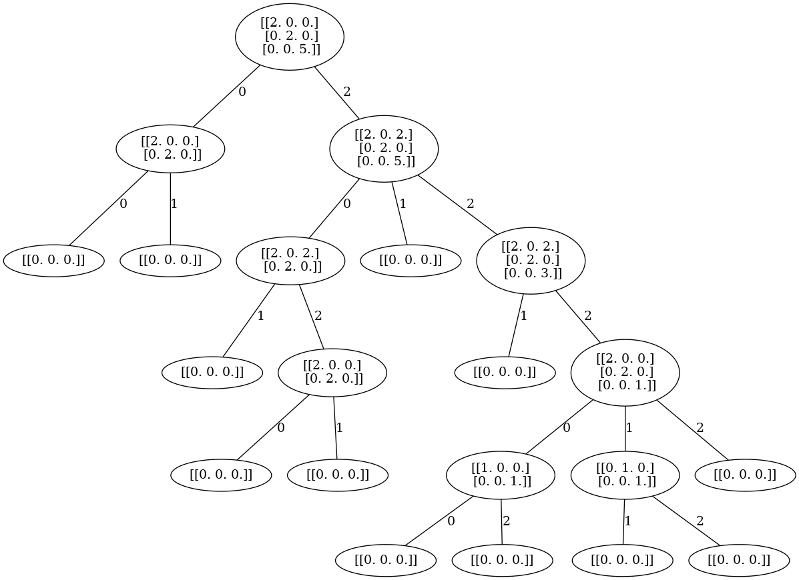

A4. Sadly the first choice was wrong. But the game did resolve within 10 blow-ups.

### D4
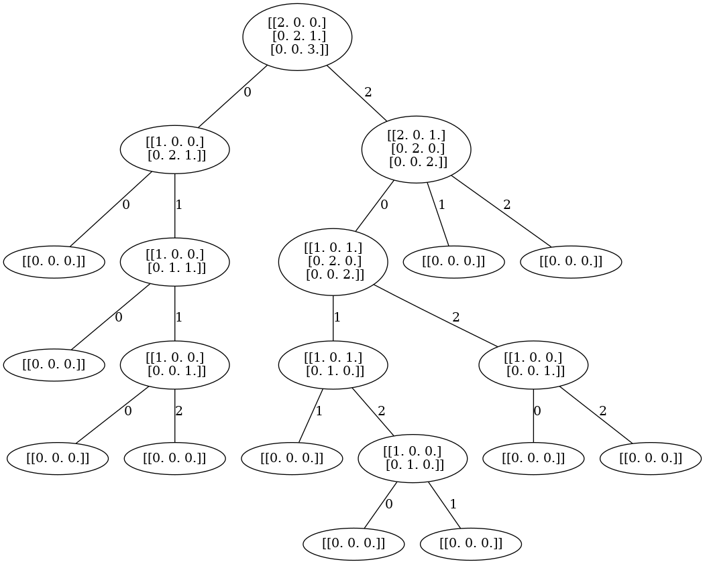

D4. Seems to be optimal. Note that any occurence of $(x_1, x_2, x_3)$ where $x_1+x_2+x_3=1$ is already a smooth point, despite the game not being terminate. We could tweak that in a later version.

### D5
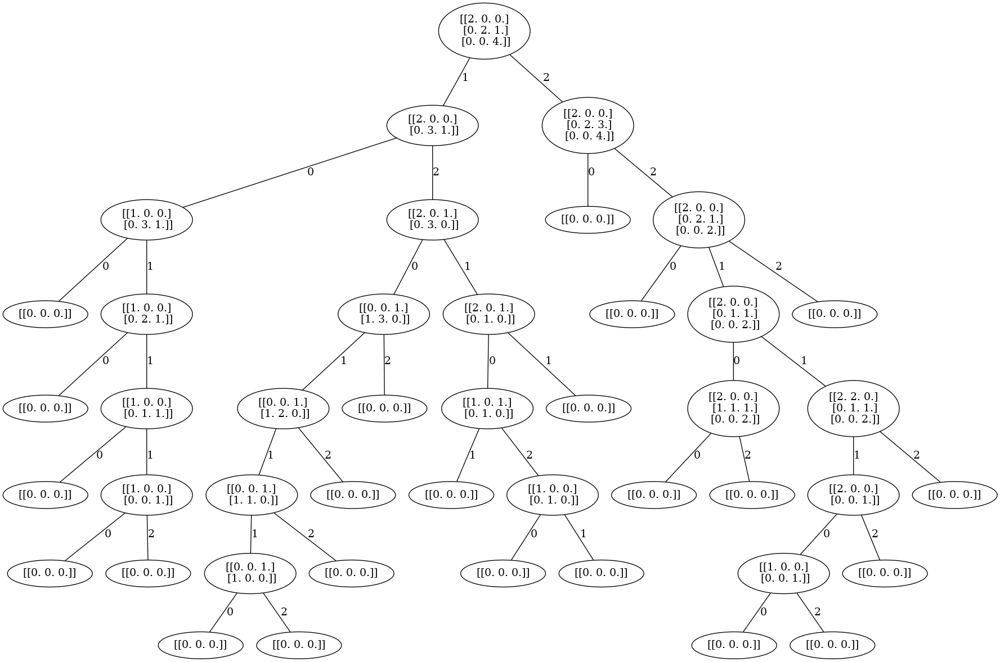

D5. Haven't checked. But again, most of the game states are in fact already smooth. It might be or at least very close to the Dynkin diagram.

### E6
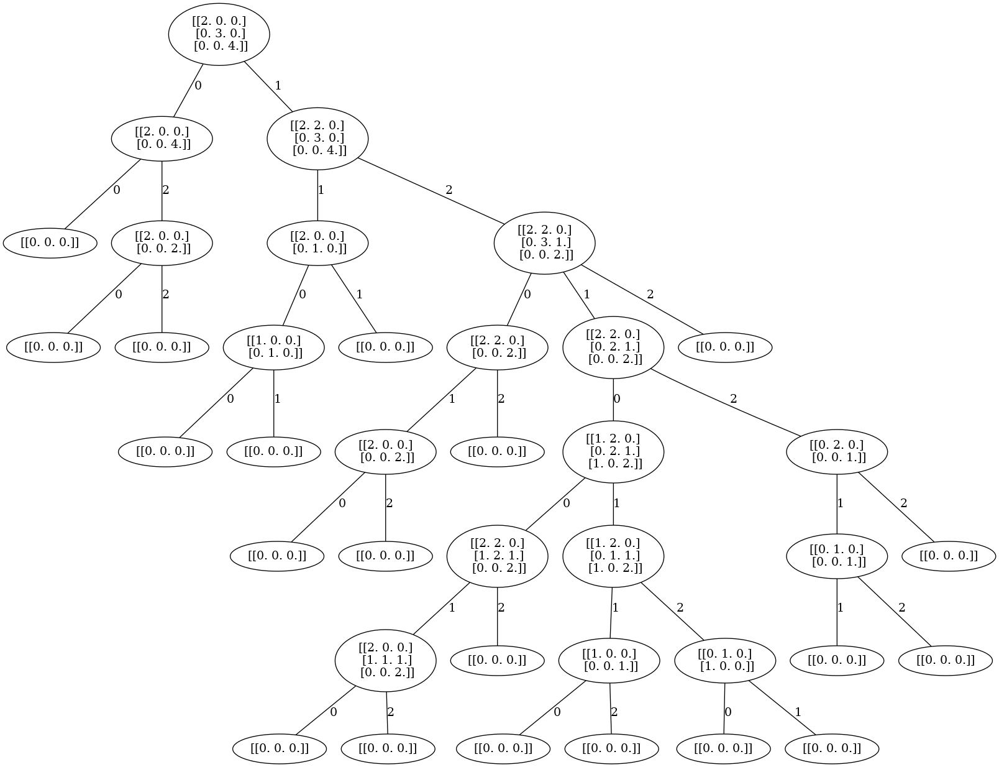

E6

### E7
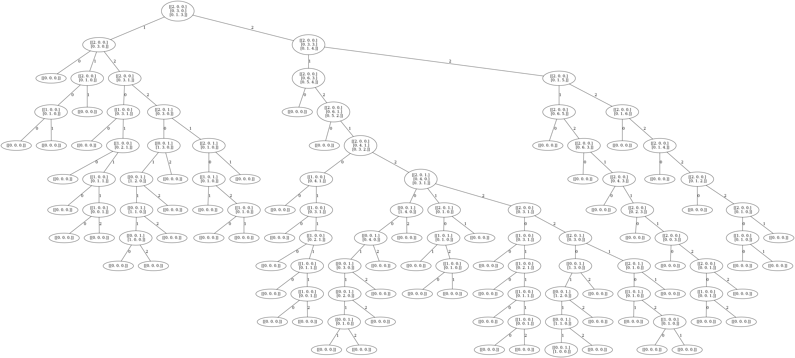

E7

### E8
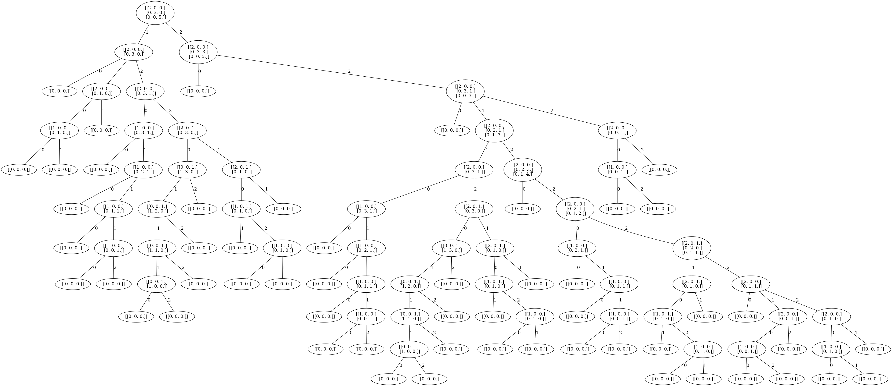

E8
