# Small net scaling up experiments

In this experiment, I started with 2 layers of residue net where each residue block is like the following
```
(2): ResidualBlock(
    (lin1): Linear(in_features=256, out_features=256, bias=True)
    (bn1): BatchNorm1d(256, eps=1e-05, momentum=0.1, affine=True, track_running_stats=True)
    (relu): ReLU(inplace=True)
    (lin2): Linear(in_features=256, out_features=256, bias=True)
    (bn2): BatchNorm1d(256, eps=1e-05, momentum=0.1, affine=True, track_running_stats=True)
  )
```

The first residue block has a down-sampling layer (actually up-sampling for the name's sake) to match the output size.
```
(down_sample): Sequential(
      (0): Linear(in_features=60, out_features=256, bias=True)
      (1): BatchNorm1d(256, eps=1e-05, momentum=0.1, affine=True, track_running_stats=True)
    )
```

I scaled up gradually to 10 layers. For each network architecture I tried 3 different batch sizes: 256, 1024, 8192.

# Take away:
- The sweet spot of batch size seems to be 256. I think the reason was that perhaps sample with repeating data (bootstraping) is harmful. For higher batch sizes, the replay buffer does not have enough data points (initial rollout 100 x max step 20). In the extreme case, when batch size is 8196, which is more than the initial sample (< 2000). The roll out happens in average 1 per step (400 step delay, 20 games x 20 steps) which is also slow. Higher batch size might work, but higher rollout will be necessary.

**Warning**: Every set-up was only run once due to resources restrictions. Models may be sensitive to random seeds and conclusions need to be drawn with care across multiple set-ups.

# 2 layer:
Loss:

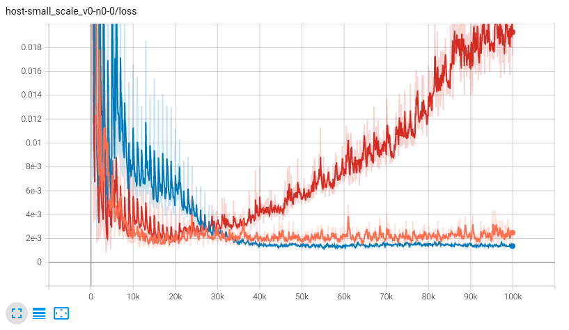

Vs ChooseFirst:

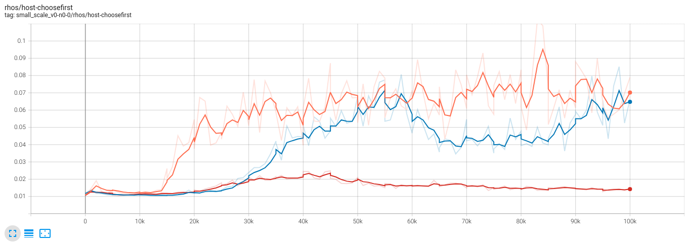

Vs Random:

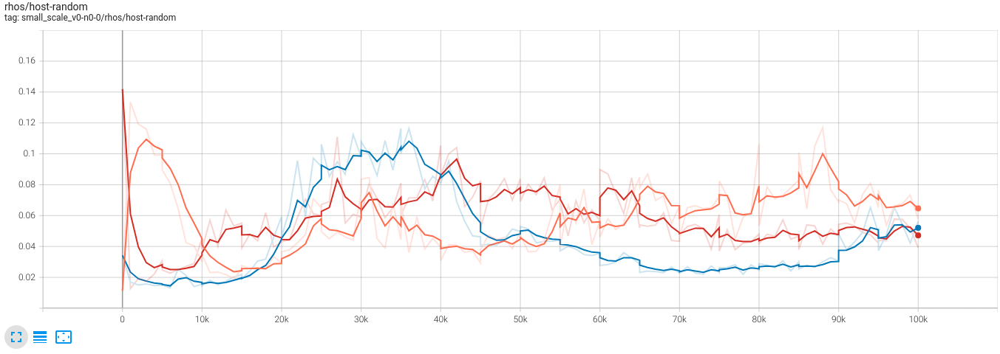

Remark:

- The 256, 1024, 8192 batches are orange, blue, red, respectively. Apparently, too high batch size is detrimental for small networks, as double-confirmed in the previous small-scale batch size experiment. For this particular run, 1024 was the sweet spot but it is known that training is very sensitive to random seeds. From the $\rho$ value, I would argue that 256 and 1024 have similar performances.

# 4 layer:

Loss:

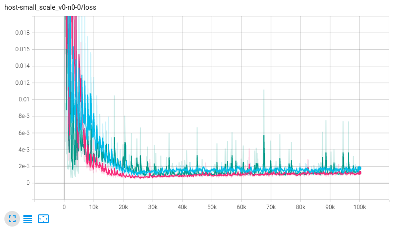

Vs ChooseFirst:

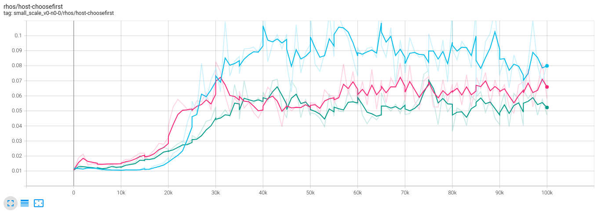

Vs Random:

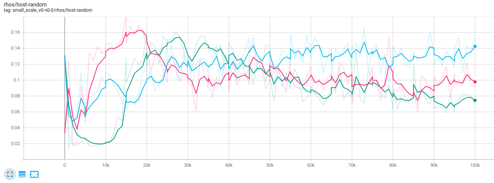

Remark:

- When the network size is large enough, 8192 batch finally converges. From low to high they are: Blue, pink, green. It is quite obvious that blue achieved the best performance and its batch size is 256. Higher batch size still seems to be detrimental for a fixed period of run for unknown reasons.
- Maybe learning rate and experiment steps need to be adjusted for different batch size?


# 6 layer:

Loss:

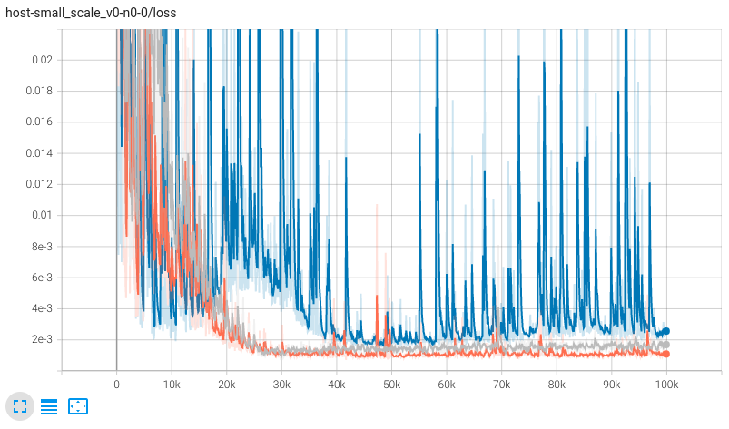

Vs ChooseFirst:

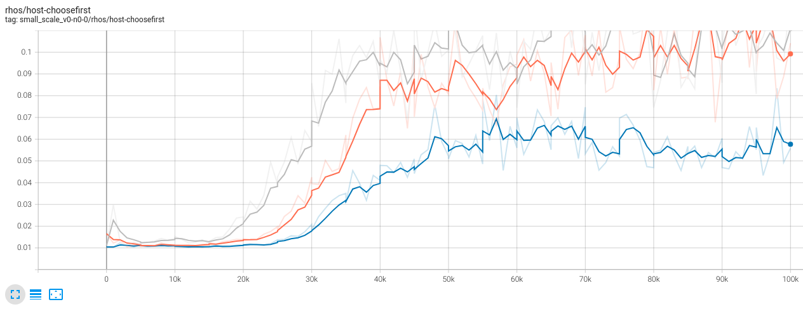

Vs Random:

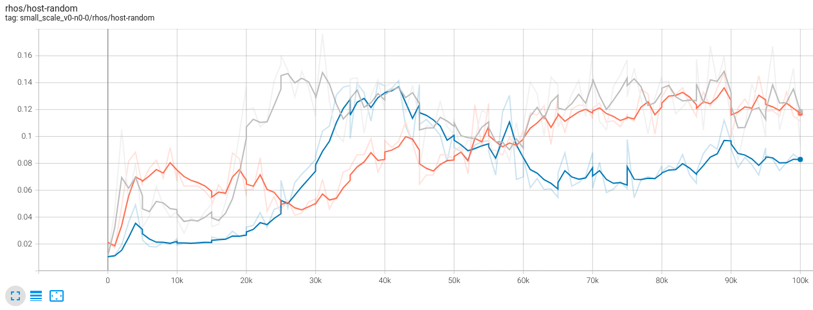

Remark:

- 256, 1024, 8192 are grey, orange, blue. It shows the same phenomena as 4-layer case. 8192 is on the verge of diverging (loss varies from 0.02 to 2e-3 multiple times). Interestingly, 1024 achieved the best loss (but not the best performance).

# 8 layer:

Loss:

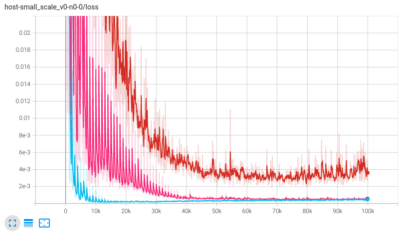

Vs ChooseFirst:

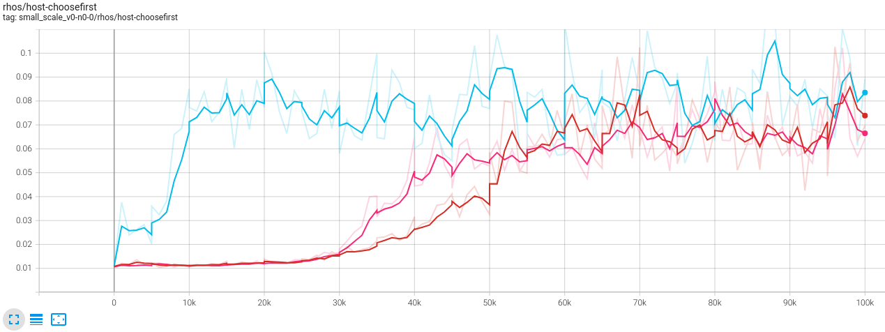

Vs Random:

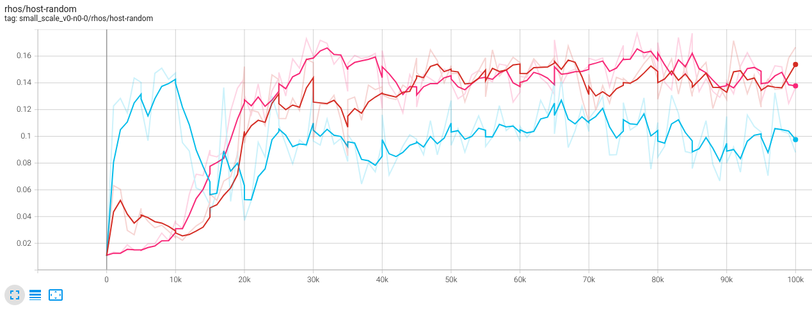

Remark:

- 256, 1024, 8192 are red, blue, pink. It is interesting to see that the loss reduction again has 1024 as its sweet spot (maybe eventually has to do with the replay buffer size?). This blue one is particular interesting as it realized a good way to beat ChooseFirst agent at a very early stage (<10k) and persists. 10k was its peak performance (good against ChooseFirst and good against random with $\rho=0.14$). The eventual performance are similar for 256 and 8192 and slightly better than 1024.
- Perhaps evolution method should be used in model selection?

# 10 layer:

Loss:

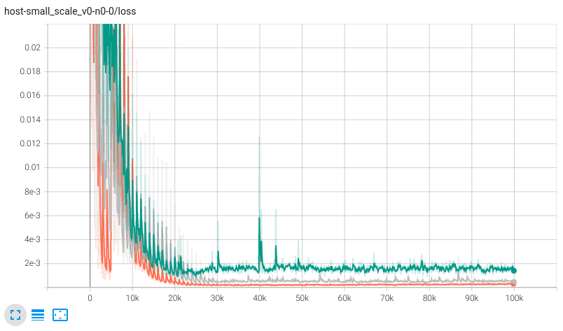

Vs ChooseFirst:

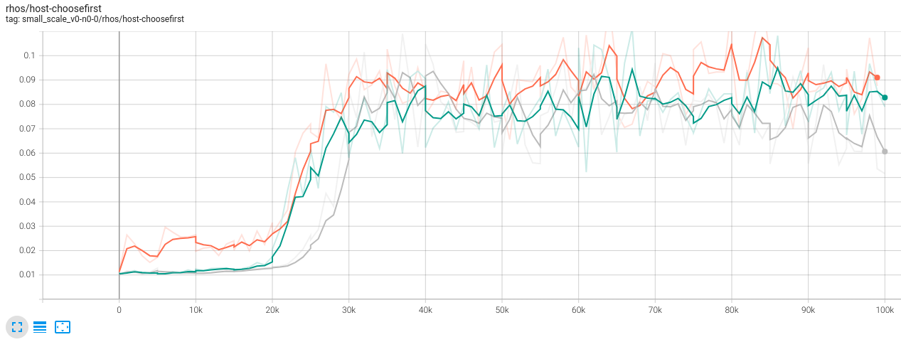

Vs Random:

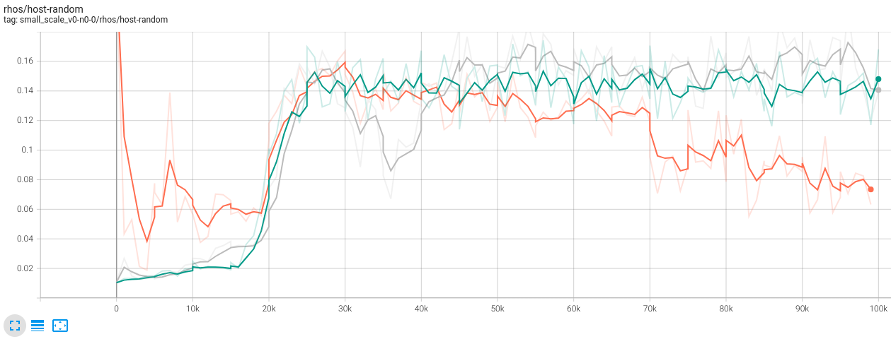

Remark:

- 256, 1024, 8192 are green, grey, orange. Now orange achieved the best loss reduction overall (even comparing with different network sizes). The performance is sadly only mediocre. The model might have started to overfit there.
