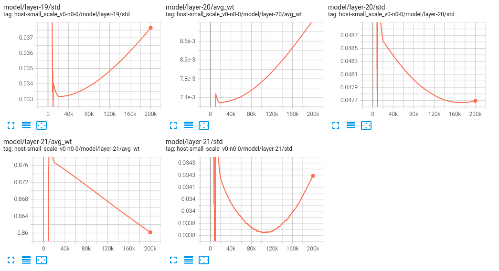

# small scale experiment v0

## experiment info
Train a host network versus `ChooseFirstAgent`. 20 checkpoints. Total of 200k steps.
Details see config yaml file.

## Sample games
(Note: point coordinates are all scaled to [0,1].)
Let's watch how it does in some games:

```
[[[0.3684210526315789, 0.15789473684210525, 0.15789473684210525], [0.5789473684210527, 0.8421052631578947, 0.5263157894736842], [0.15789473684210525, 0.42105263157894735, 0.0], [0.8947368421052632, 0.8947368421052632, 0.7368421052631579], [0.9473684210526315, 0.3684210526315789, 0.7894736842105263], [0.7894736842105263, 0.21052631578947367, 0.9473684210526315], [0.0, 0.5263157894736842, 0.05263157894736842], [0.21052631578947367, 0.10526315789473684, 0.7368421052631579], [0.9473684210526315, 1.0, 0.2631578947368421], [0.2631578947368421, 0.3157894736842105, 0.631578947368421], [0.2631578947368421, 0.05263157894736842, 0.8947368421052632], [0.5263157894736842, 0.8421052631578947, 0.7894736842105263], [0.7894736842105263, 0.631578947368421, 0.47368421052631576], [0.21052631578947367, 0.3684210526315789, 0.21052631578947367], [0.21052631578947367, 0.10526315789473684, 0.0], [0.8421052631578947, 0.5789473684210527, 0.0], [0.10526315789473684, 0.10526315789473684, 0.6842105263157895], [0.42105263157894735, 0.05263157894736842, 0.8947368421052632], [0.8947368421052632, 0.3684210526315789, 0.3157894736842105], [0.8947368421052632, 0.0, 0.42105263157894735]]]
Host move: [[1, 2]]
Agent move: [1]
Game Ended: False
[[[0.3636363636363636, 0.1818181818181818, 0.0], [0.2727272727272727, 0.7272727272727272, 0.0], [0.0, 1.0, 0.0909090909090909]]]
Host move: [[0, 1, 2]]
Agent move: [0]
Game Ended: True
```

2-step killer. Already showed different choices of moves. Smart!

```
[[[0.10526315789473684, 0.631578947368421, 0.3684210526315789], [0.8421052631578947, 0.9473684210526315, 0.5789473684210527], [0.7894736842105263, 0.3684210526315789, 0.5263157894736842], [0.8421052631578947, 0.5789473684210527, 0.42105263157894735], [0.2631578947368421, 0.10526315789473684, 0.3684210526315789], [0.7894736842105263, 0.6842105263157895, 0.7894736842105263], [1.0, 0.7894736842105263, 0.5789473684210527], [0.9473684210526315, 0.2631578947368421, 1.0], [0.6842105263157895, 0.15789473684210525, 0.9473684210526315], [0.05263157894736842, 0.0, 0.21052631578947367], [0.2631578947368421, 0.47368421052631576, 0.10526315789473684], [0.42105263157894735, 0.10526315789473684, 0.3157894736842105], [0.9473684210526315, 0.9473684210526315, 0.3157894736842105], [0.3157894736842105, 0.2631578947368421, 0.0], [0.631578947368421, 0.8947368421052632, 0.10526315789473684], [0.10526315789473684, 0.47368421052631576, 0.05263157894736842], [0.7894736842105263, 1.0, 0.5789473684210527], [0.5263157894736842, 0.5263157894736842, 0.631578947368421], [0.0, 0.6842105263157895, 0.2631578947368421], [0.8947368421052632, 0.3157894736842105, 0.631578947368421]]]
Host move: [[1, 2]]
Agent move: [1]
Game Ended: False
[[[0.3333333333333333, 0.27777777777777773, 0.0], [0.1111111111111111, 0.5555555555555555, 0.05555555555555555], [0.05555555555555555, 0.2222222222222222, 0.2222222222222222], [0.0, 1.0, 0.27777777777777773]]]
Host move: [[0, 2]]
Agent move: [0]
Game Ended: False
[[[0.6000000000000001, 0.5, 0.0], [0.5000000000000001, 0.4, 0.4], [0.30000000000000004, 1.0, 0.1]]]
Host move: [[0, 2]]
Agent move: [0]
Game Ended: False
[[[0.9000000000000001, 0.4, 0.4], [0.6000000000000001, 0.5, 0.0], [0.4, 1.0, 0.1]]]
Host move: [[1, 2]]
Agent move: [1]
Game Ended: False
[[[0.5454545454545455, 0.45454545454545453, 0.0], [0.36363636363636365, 1.0, 0.09090909090909091]]]
Host move: [[0, 1, 2]]
Agent move: [0]
Game Ended: True
```

An interesting game. Alternating [1,2] and [0,2] and finally applied all coordinates. What is really cool here is that for the last state, neither [0, 2] nor [1, 2] finishes the game. Only [0,1] or [0,1,2] worked which is a choice that the model did not make before.


## Network structure
Two layer residue networks:

```
Sequential(
  (0): HostFeatureExtractor(
    (flatten): Flatten(start_dim=1, end_dim=-1)
  )
  (1): ReLU()
  (2): ResidualBlock(
    (lin1): Linear(in_features=60, out_features=256, bias=True)
    (bn1): BatchNorm1d(256, eps=1e-05, momentum=0.1, affine=True, track_running_stats=True)
    (relu): ReLU(inplace=True)
    (lin2): Linear(in_features=256, out_features=256, bias=True)
    (bn2): BatchNorm1d(256, eps=1e-05, momentum=0.1, affine=True, track_running_stats=True)
    (down_sample): Sequential(
      (0): Linear(in_features=60, out_features=256, bias=True)
      (1): BatchNorm1d(256, eps=1e-05, momentum=0.1, affine=True, track_running_stats=True)
    )
  )
  (3): ReLU()
  (4): ResidualBlock(
    (lin1): Linear(in_features=256, out_features=256, bias=True)
    (bn1): BatchNorm1d(256, eps=1e-05, momentum=0.1, affine=True, track_running_stats=True)
    (relu): ReLU(inplace=True)
    (lin2): Linear(in_features=256, out_features=256, bias=True)
    (bn2): BatchNorm1d(256, eps=1e-05, momentum=0.1, affine=True, track_running_stats=True)
  )
  (5): Linear(in_features=256, out_features=4, bias=True)
)
```

## Final validation

10000 step match. Count how many separate games there are during the 10000 steps.

```
PolicyHost vs ChooseFirstAgent
 - number of games:326
PolicyHost vs RandomAgent
 - number of games:1654
RandomHost vs ChooseFirstAgent
 - number of games:488
RandomHost vs RandomAgent
 - number of games:1481
AllCoordHost vs ChooseFirstAgent
 - number of games:10
AllCoordHost vs RandomAgent
 - number of games:2139
Zeillinger vs ChooseFirstAgent
 - number of games:719
Zeillinger vs RandomAgent
 - number of games:1898
```

## Pictures

### Loss


A few layer weight info (first a few and last a few):





