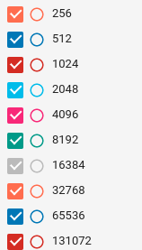
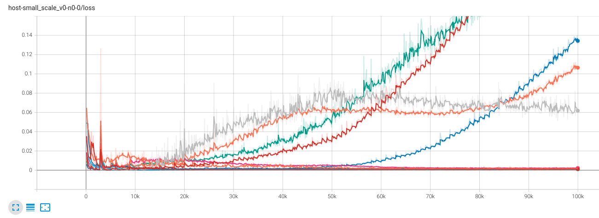
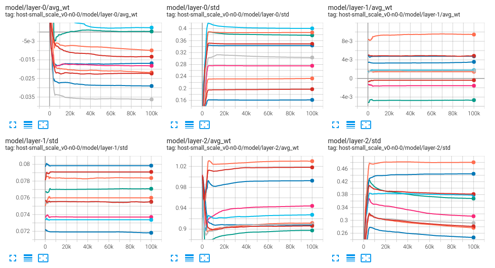
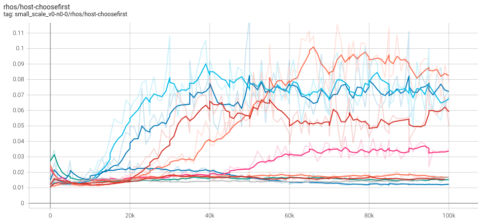
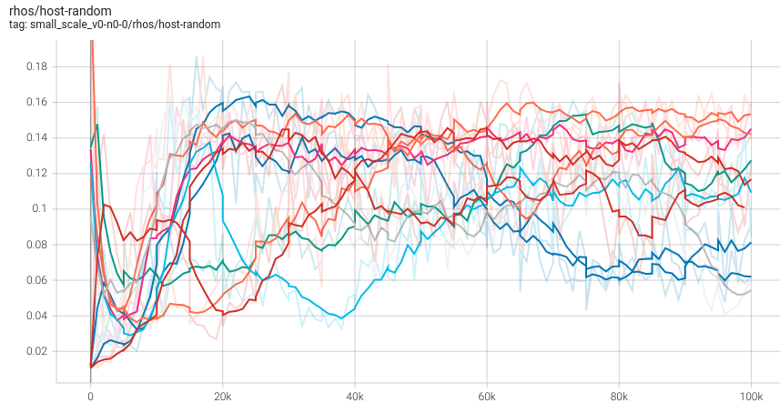

# Small scale model with varying batch sizes
The configuration is exactly the same as [small-scale-against-choosefirst-v0](small-scale-against-choosefirst-v0). I did 10 runs on varying batch sizes.

Legend:

Loss:

In fact layer weights got stable very fast. Here are some sample pictures on the first a few layers:

$\rho$ metric:
 - vs ChooseFirst:
 
 

 - vs Random:
 
 
