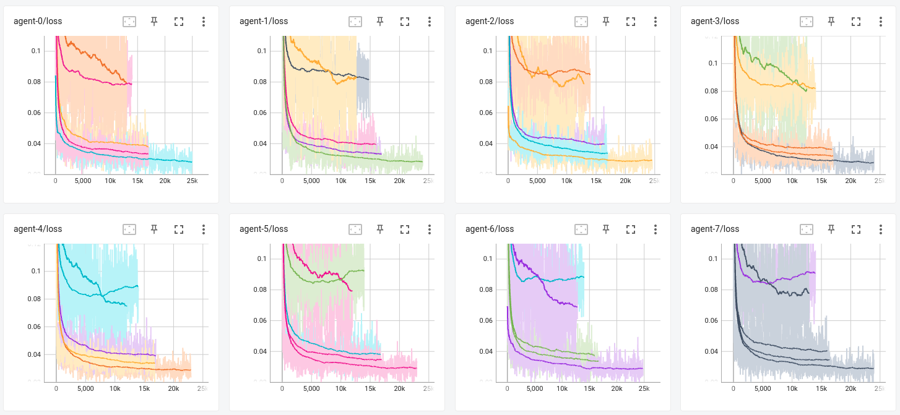
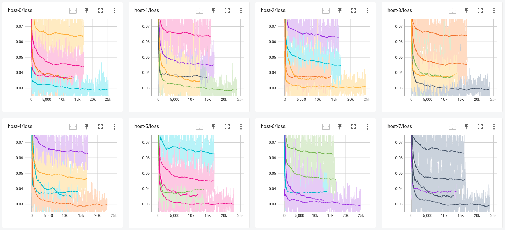
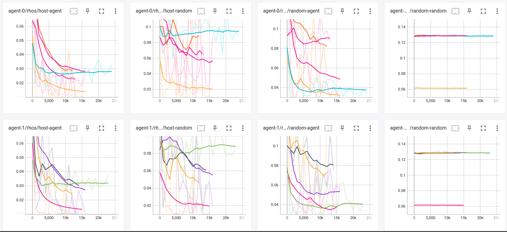
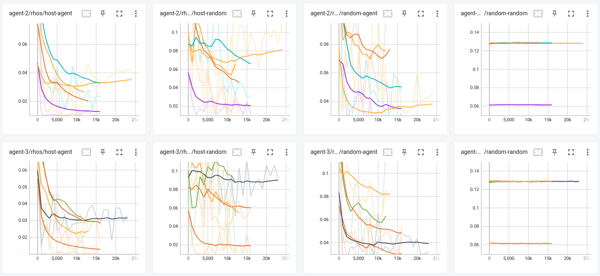
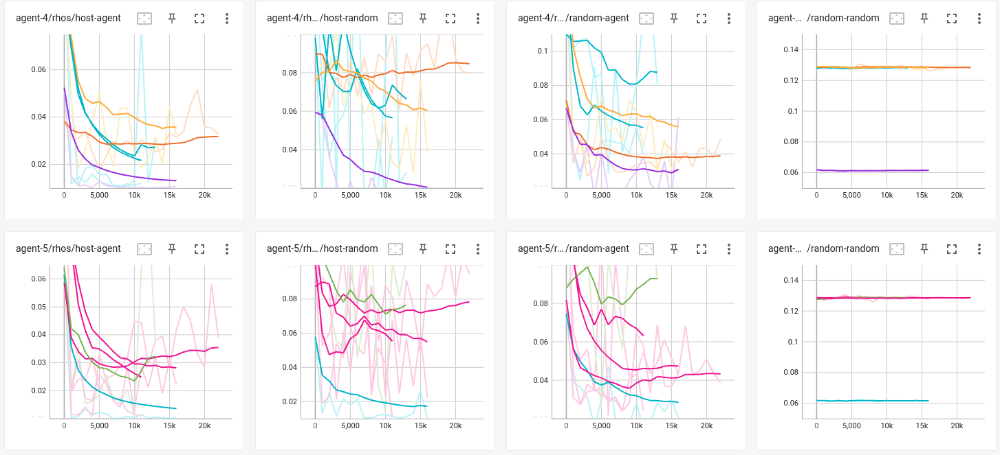
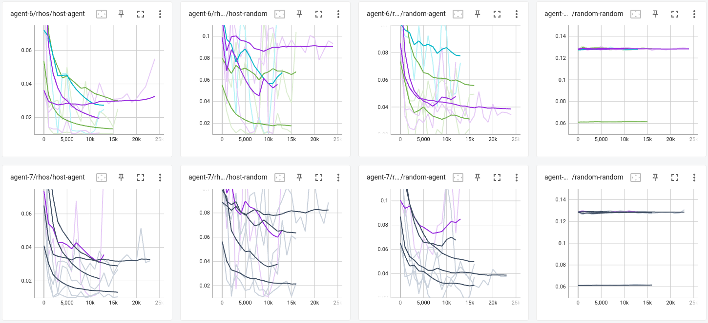

# first batch of v0 models#
This is the first attempt of a mass scale training. We only trained the [original model](trainer_cfg_v0.yml) and [10-rollout model](trainercfg_v0-10-rollout.yml), plus a [huge one](trainer_cfg_v0-huge.yml) which is 10-dimensional with 100 points. The result is less than ideal. But it marks a first systematic attempt of training.

10-dim models have gigantic amount of logs so we omit them.

Training script: [v0.py](v1.py)

Metrics: As introduced in the main repo, the quantity $\rho$ is a good measurement of relative strength between host and agent. We measure $\rho$ of (host_net, agent_net), (host_net, RandomAgent), (agent_net, RandomHost), (RandomHost, RandomAgent) every 1000 steps as well as in the end. (The last pair (RandomHost, RandomAgent) only served as a sanity test. It should be a constant depending on the dimension and max number of points.)

Method: DQN (from DQNTrainer whose core updating logic is exactly the same as DQN from stable-baseline3). We train the pair of host and agent simultaneously for 10 steps, generate new experiences and rinse-and-repeat.

Observations: All the models seem to converge somewhere. But Hosts are significantly weaker than Agent. Agents have certain amount of generalizability when compared with other strategies (including RandomHost), but Host does not at all. 

Charts: the loss and the rhos ([host_net, RandomHost] vs [agent_net, RandomAgent], every 1000 step)

